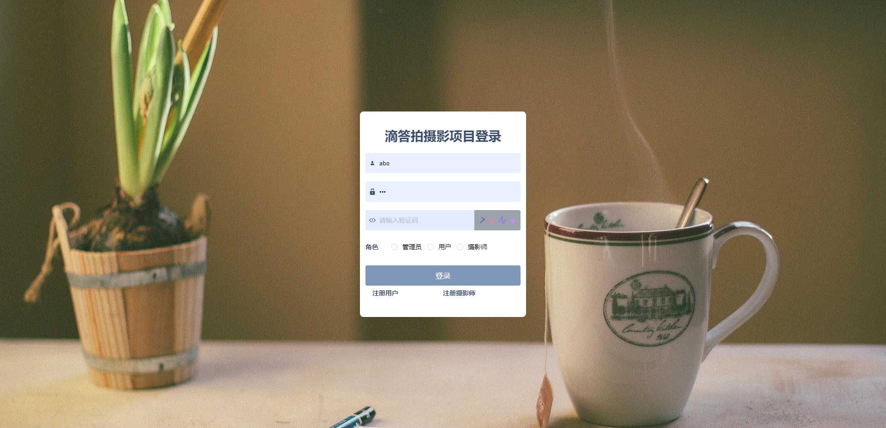
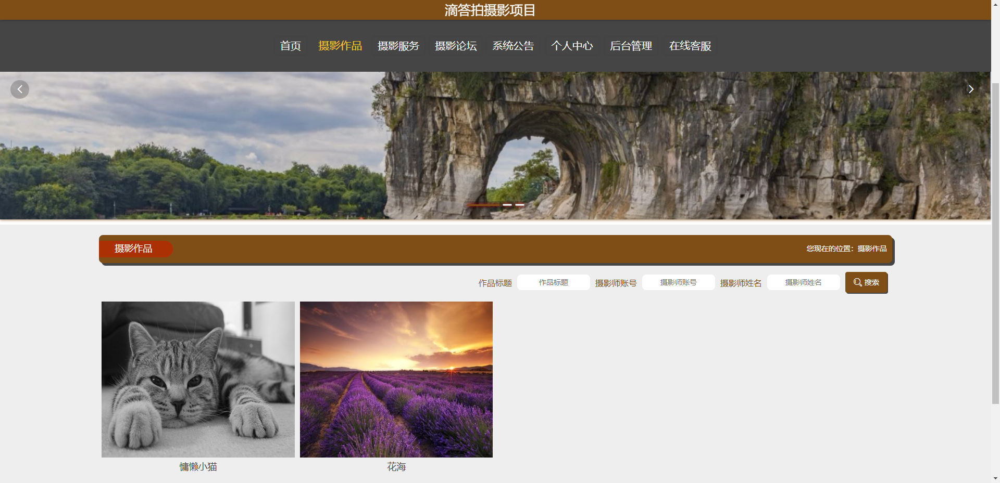
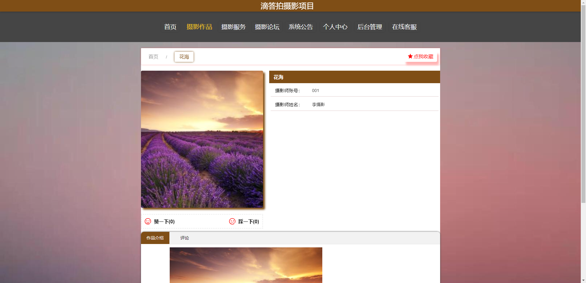
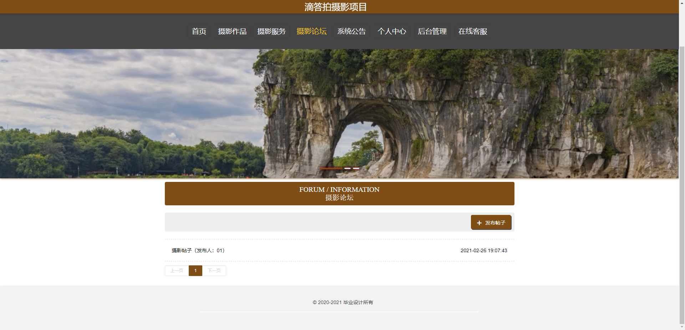
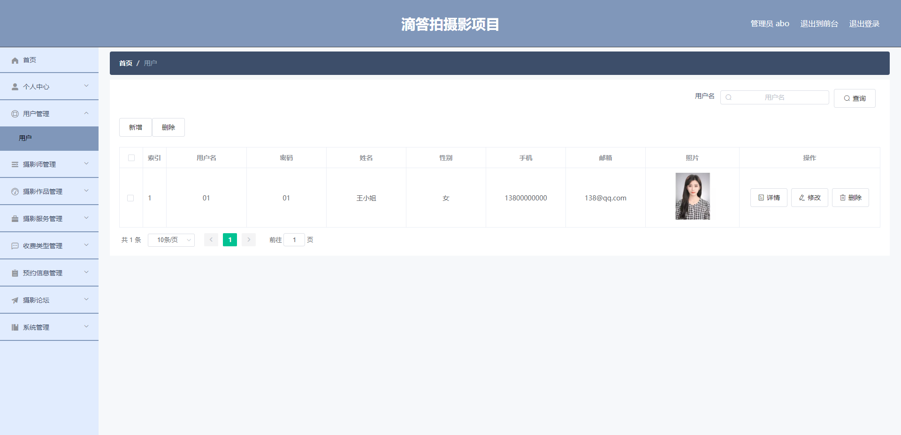
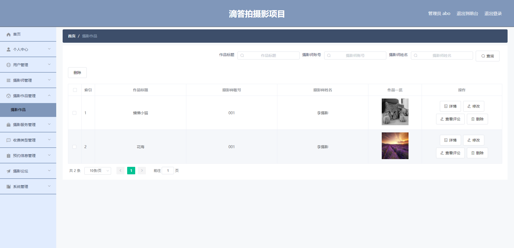
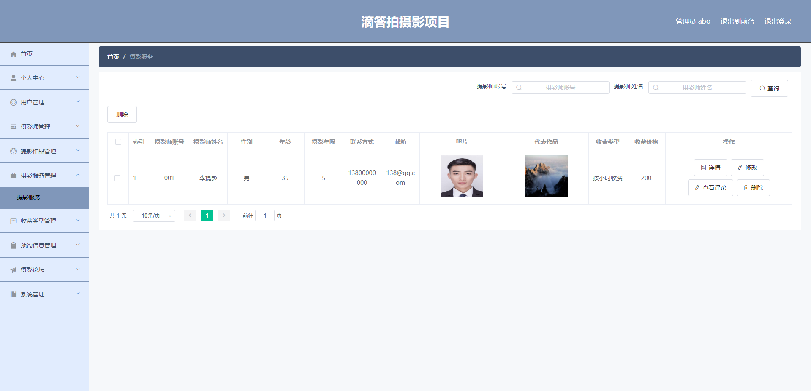
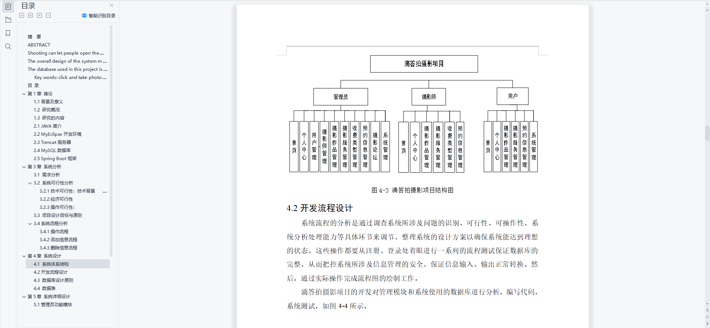
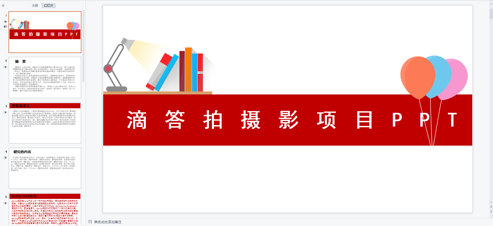
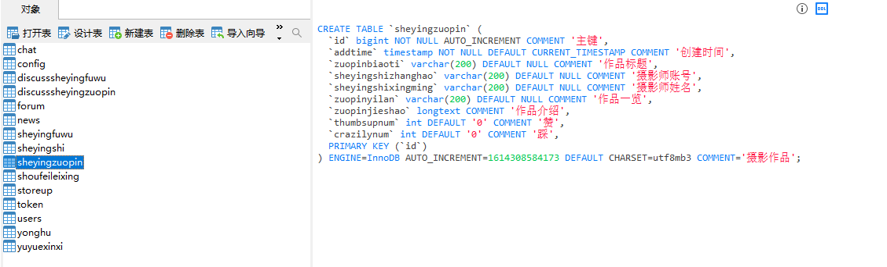

# 1 项目介绍
基于SSM+Vue的摄影系统：后端 SpringBoot、Mybatis-Plus，前端Vue+ElementUI，具体功能如下：
## 管理员
- 个人中心：查看和修改个人信息、修改密码
- 用户管理
- 摄影师管理
- 摄影作品管理
- 摄影服务管理
- 收费类型管理
- 预约信息管理
- 摄影论坛
- 系统管理(包括系统公告、轮播图管理、在线客服)
## 摄影师
- 个人中心：查看和修改个人信息、修改密码
- 摄影作品管理
- 摄影服务管理
- 收费类型管理
- 预约信息管理
## 用户
- 个人中心：查看和修改个人信息、修改密码
- 摄影作品管理
- 摄影服务管理
- 预约信息管理
- 在线客服
# 2 系统运行截图
## 2.1 用户登录

## 2.2 摄影作品

## 2.3 作品详情

## 2.4 摄影论坛

## 2.5 用户管理

## 2.6 摄影做品管理

## 2.7 摄影服务管理

## 2.8 万字文档

## 2.9 PPT

# 3 数据库设计

# 4 源码数据库获取(收费)

